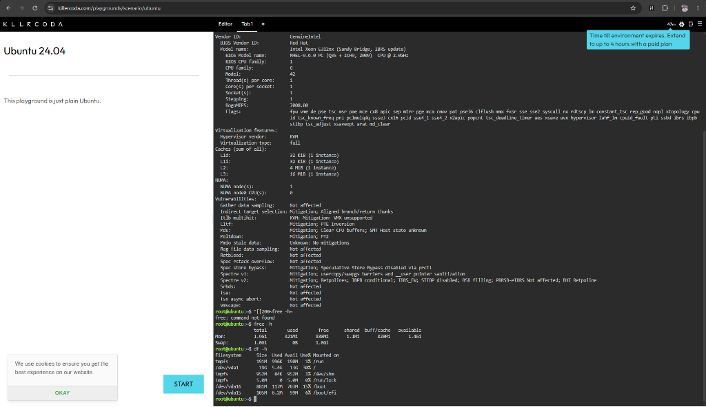

## Checkpoint 7: Linux Server Investigation & Cloud Mapping

### System Specifications (KillerCoda Playground)
* **Operating System:** Ubuntu 24.04.4 LTS (Noble Numbat)
* **Architecture:** x86_64 (1 vCPU, Intel Xeon @ 2.0GHz, KVM Virtualized)
* **Memory (RAM):** ~1.9 GiB Total (~1.4 GiB available)
* **Disk Space:** ~19 GiB Root Filesystem (`/dev/vda1` with ~13 GiB available)

### Terminal Output Evidence

### Cloud Service Mapping
If this Linux server environment were migrated to major public cloud platforms, it could be hosted using the following equivalent virtual machine services:
* **AWS:** **Amazon EC2** using a general-purpose instance type (such as a `t3.small` or `t3.medium` to match the ~2 GiB RAM footprint).
* **Azure:** **Azure Virtual Machines** using a light general-purpose size (such as a `Standard_B1s` or `Standard_B2s` instance running Ubuntu 24.04).
* **GCP:** **Google Compute Engine (GCE)** using a comparable machine type (such as an `e2-micro` or `e2-small` instance).
